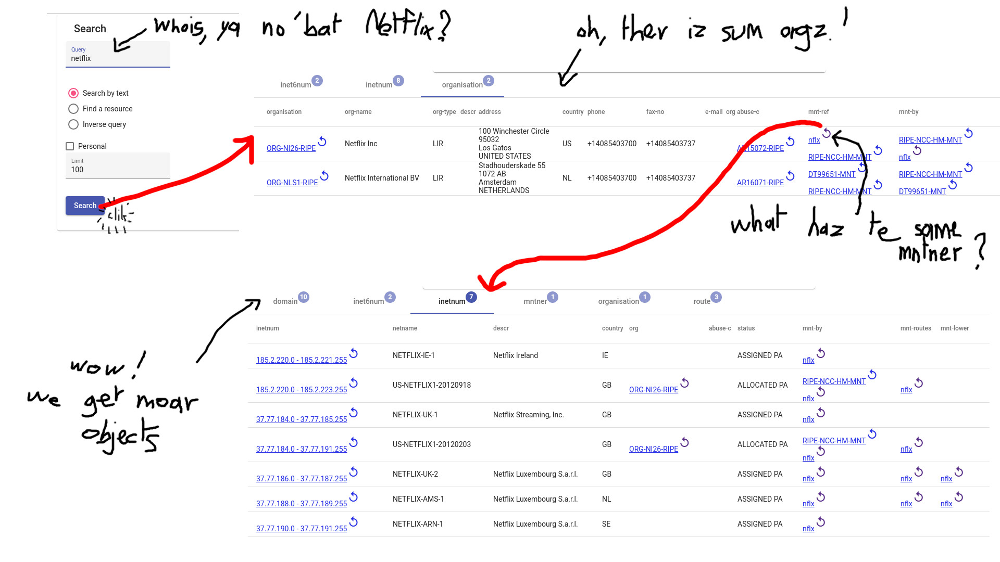

# whois-web-ui
A Web UI based on the RIPE REST Whois API

Basically, it offers 2 features :

  * show the results of a whois query grouped by object type, in a tabular form ;
  * allows to quickly make inverse search on an object.

